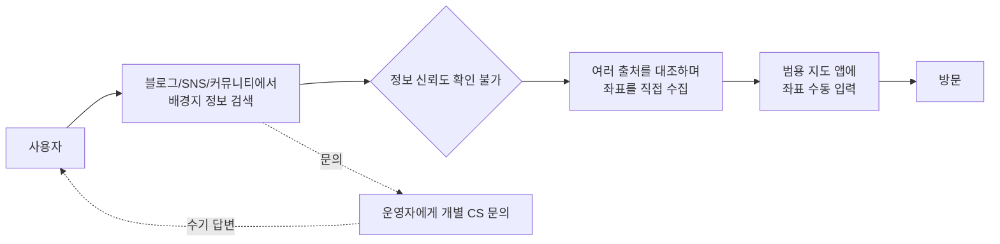
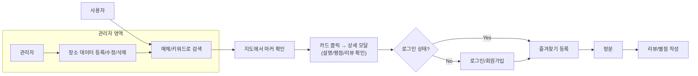
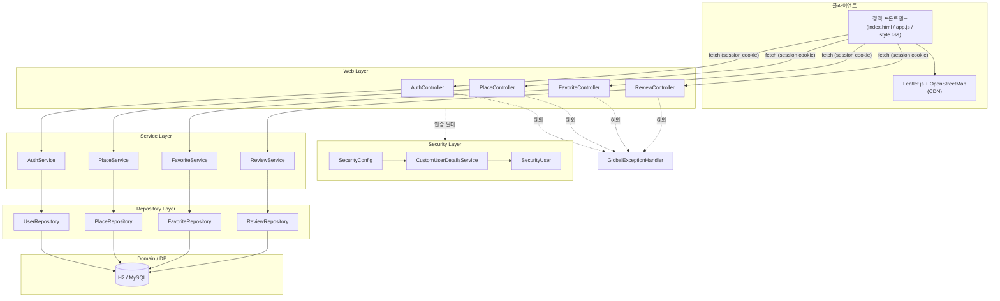
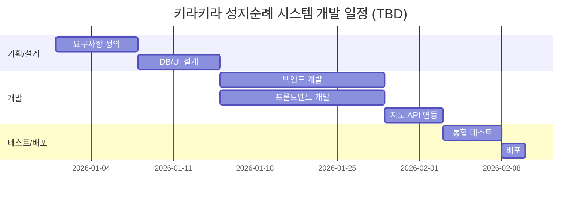
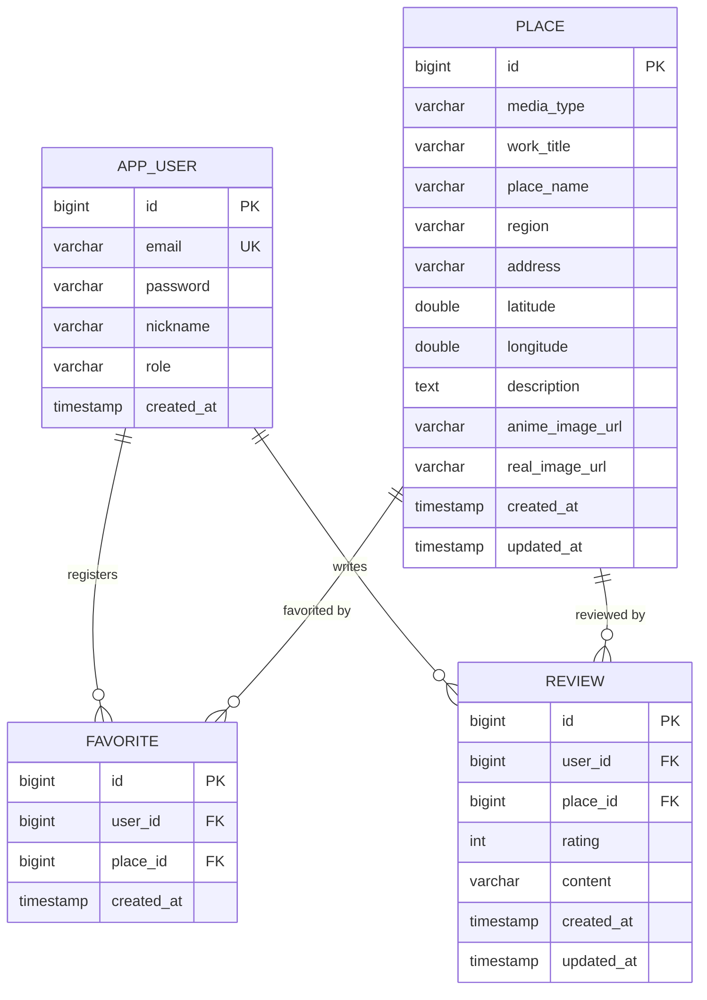

# 키라키라 성지순례 시스템 — 전체 기획 문서

일본 미디어(애니메이션/영화/드라마) 성지순례 매핑 및 방문 인증 시스템

> 1~5, 8~11, 15~18번 항목은 기존 기획 문서(`키라키라_성지순례_시스템.md`)와 현재 구현된 백엔드/프론트엔드 코드(`pilgrimage/`)를 근거로 작성했습니다.
> 6·7·12·13·14·19번 항목은 실제 설문/VOC/일정/조직 데이터가 없어 **작성 가이드가 포함된 빈 템플릿**으로 제공합니다. 실제 값으로 채워 넣으시면 됩니다.
> **2026-08-25 업데이트**: 지도 연동이 Google Maps에서 **Leaflet.js + OpenStreetMap**(무료, API 키 불요)으로 변경되었고, 장소 이미지가 **작품 이미지/실제 사진 2종 비교**로 확장되었으며, **관리자 장소 관리 화면(프론트엔드)**이 추가되고 전체 UI가 "빈티지 여행 티켓/우표" 컨셉으로 리디자인되었습니다. 반영된 항목: 2, 4, 8, 9, 15~18번.

---

## 1. 개요

일본의 유명 애니메이션, 영화 및 드라마의 실제 배경지(성지 및 촬영지) 정보를 통합하고, 사용자가 쉽게 찾아갈 수 있도록 지도 기반의 정보 제공 서비스를 구축한다.

기존의 방대한 위치 정보와 사진을 관리자가 중앙에서 신뢰성 있게 제공하며(Read-heavy), 사용자는 해당 장소 검색 및 즐겨찾기, 간단한 리뷰를 남길 수 있는 직관적인 웹 시스템을 Java(Spring Boot) 기반으로 구현한다.

### 주요 동기

- **정보의 파편화**: 작품별 실제 배경지의 정확한 위도/경도 데이터가 흩어져 있어 검색 비용이 높음
- **동선 기획의 편의성 필요**: 텍스트 위주의 정보로는 여행객이 실제 이동 동선을 효율적으로 짜기 어려움
- **학습 및 구현의 효율성**: 과도한 실시간 위치(GPS) 연동 및 복잡한 권한 승인 기능을 배제하고, 핵심적인 CRUD(게시판)와 지도 API 기능에 집중

---

## 2. 목표

- 지도 API(Leaflet.js + OpenStreetMap) 연동을 통한 직관적인 위치 정보 및 마커 제공
- 매체(애니, 영화, 드라마) 및 키워드 기반의 빠른 장소 검색 필터링 기능 구현
- 사용자의 관심 장소 즐겨찾기(찜) 및 텍스트 리뷰/별점 작성 기능 제공

---

## 3. CSF / KPI

### CSF (핵심 성공 요인)

| CSF | 내용 |
|---|---|
| 데이터 신뢰성 | 관리자 중앙 관리로 배경지 위경도/정보의 정확도 확보 |
| 검색 편의성 | 매체·키워드 필터로 원하는 장소를 빠르게 탐색 |
| 참여 유도 | 즐겨찾기/리뷰로 사용자가 재방문할 이유 제공 |
| 시스템 경량성 | GPS·복잡한 권한체계 배제로 안정적인 운영 |

### KPI

| 구분 | KPI 측정 방식 | AS-IS | TO-BE | 측정 주기 및 방법 |
|---|---|---|---|---|
| 업무/탐색 효율성 | 성지순례 동선 기획 소요 시간 | 2시간 | 30분 이내 | Monthly (사용자 테스트 및 로그 분석) |
| 사용자 참여도 | 장소별 리뷰 및 별점 등록 건수 | 0건 | 월 50건 이상 | Monthly (DB Review Insert 로그) |
| 서비스 활용도 | 사용자별 즐겨찾기(찜) 등록 건수 | 0건 | 월 100건 이상 | Monthly (DB Bookmark 활성도 통계) |

---

## 4. 시스템 개발 요청서

| 항목 | 내용 |
|---|---|
| 프로젝트명 | 일본 미디어 성지순례 매핑 및 정보 제공 시스템 |
| 비즈니스 필요성 | 신뢰할 수 있는 관광 데이터를 중앙에서 관리하여 제공하고, 사용자에게 필수적인 검색 및 리뷰 기능만을 제공하여 시스템의 가벼움과 안정성을 확보한다 |
| 비즈니스 요구 | - 매체 분류(애니메이션, 영화, 드라마) 및 키워드(작품명, 지역명 등) 검색을 통한 배경지 RDBMS 데이터 조회(Read)<br>- Leaflet.js + OpenStreetMap 타일을 이용해 DB에 저장된 위경도 좌표에 마커(Marker)를 표시하고, 카드 목록과 지도가 분할 레이아웃으로 연동됨<br>- 장소별 '작품 이미지'와 '실제 촬영 사진'을 함께 등록·비교 노출<br>- 관리자(Admin) 전용 프론트엔드 화면을 통한 장소 데이터 등록, 수정, 삭제(C/U/D) 중앙 관리<br>- 일반 사용자는 회원가입/로그인 후 관심 장소 '즐겨찾기' 및 텍스트 리뷰/별점 남기기 가능 |
| 비즈니스 가치 | - 핵심 비즈니스 로직(검색, 필터링, 게시판 CRUD)에 집중하여 안정적인 Java(Spring) 웹 서비스 아키텍처 구현<br>- 여행 정보 탐색 시간을 단축하고 간편한 리뷰 기능으로 사용자의 직관적인 사용성 보장<br>- 무료 지도 API(Leaflet+OSM) 채택으로 API 키/결제 계정 없이 운영 가능, 트래픽 급증 시에만 유료 타일 서버로 교체 검토 |
| 제한사항 | - 일반 사용자는 신규 장소 등록이 불가하며, 초기 데이터는 관리자가 관리자 화면 또는 DB 시드로 적재해야 함<br>- GPS 기반 실시간 위치 확인 기능은 제외하며, 지도 내 정보 표시에 집중함 |

---

## 5. 타당성 분석

### 기술적 타당성

Java(Spring Boot)와 RDBMS(MySQL 등)를 활용한 기본적인 게시판(CRUD) 형태의 아키텍처이므로 개발 난이도가 적절하고 안정성이 매우 높다. 복잡한 모바일 하드웨어 제어(GPS)를 배제하고 외부 Map API(단순 마커 표시) 연동에만 집중하므로 주어진 기간 내 성공적인 프로젝트 완수가 가능하다.

### 경제적 타당성

산발적인 데이터 수동 검색 및 문의 응대(CS)에 들어가던 리소스가 자동화되어, 운영 인건비 및 정보 가공비 감소 — **연간 약 18,000,000원 비용 절감**

**절감 비용 상세 (단위: 원)**

| 항목 | 장소 데이터 수집/가공비 | 여행 문의 응대비(CS) | 외주 번역/검수비 | 서버 유지보수(수기) |
|---|---|---|---|---|
| 월간비용 | 500,000 | 700,000 | 200,000 | 100,000 |
| 연간비용 | 6,000,000 | 8,400,000 | 2,400,000 | 1,200,000 |

연 비용 합: **18,000,000원**

- 초기 구축은 오픈소스(Java/Spring) 및 무료 API(일정 트래픽 이하)를 활용하여 라이선스 비용 절감, 내부 역량 개발로 외부 용역비 최소화
- 개발 투입 비용은 약 1,800만 원 예상 (1인 개발 기준)
- 부가 수익: 호텔/교통패스 제휴(Affiliate) 연 1,200만 원 + 배너 광고 연 600만 원 = 연 1,800만 원

**[Summary] 추정 환산 수익: 36,000,000원 / 추정 비용: 18,000,000원**

**투자 회수 기간**: 18,000,000 / 36,000,000 = 0.5년 → 오픈 후 약 6개월째부터 순이익 발생 추정

---

## 6. 설문조사 결과 — ⚠️ 템플릿 (실 데이터 필요)

> 실제 설문을 진행한 뒤 아래 표를 채워 넣으세요.

### 조사 개요

| 항목 | 내용 |
|---|---|
| 조사 대상 | (예: 일본 서브컬처 팬덤, 20~30대 여행객) |
| 조사 기간 | (YYYY-MM-DD ~ YYYY-MM-DD) |
| 조사 방법 | (예: 온라인 설문, 구글 폼) |
| 표본 수 | (N=  ) |

### 문항별 결과

| 번호 | 질문 | 응답 요약 | 비고 |
|---|---|---|---|
| Q1 | | | |
| Q2 | | | |
| Q3 | | | |

### 핵심 인사이트

- (설문 결과에서 도출한 시사점 1)
- (설문 결과에서 도출한 시사점 2)

---

## 7. 설문조사 보고서 — ⚠️ 템플릿 (실 데이터 필요)

> 6번 설문 원자료를 바탕으로 정식 보고서 형식으로 정리하세요.

1. **조사 배경 및 목적**
2. **조사 방법론** (대상 선정 기준, 설문 설계, 배포 채널)
3. **주요 결과 요약** (그래프/표 삽입 위치)
4. **세부 분석** (문항별 교차분석 등)
5. **시사점 및 서비스 반영 방향**
6. **결론**

---

## 8. 기능적/비기능적 요구사항

### 기능적 요구사항 (FR)

| ID | 요구사항 | 관련 API |
|---|---|---|
| FR-01 | 회원가입 (이메일/비밀번호/닉네임) | `POST /api/auth/signup` |
| FR-02 | 로그인/로그아웃 (세션 쿠키 기반) | `POST /api/auth/login`, `POST /api/auth/logout` |
| FR-03 | 로그인 사용자 정보 조회 | `GET /api/auth/me` |
| FR-04 | 매체 타입/키워드 기반 장소 검색 | `GET /api/places` |
| FR-05 | 장소 상세 조회 (평균 별점·리뷰 수 포함) | `GET /api/places/{id}` |
| FR-06 | (관리자) 장소 등록/수정/삭제 — 전용 프론트엔드 "장소 관리" 화면 제공 | `POST/PUT/DELETE /api/admin/places` |
| FR-07 | 즐겨찾기 등록/조회/해제 | `GET/POST/DELETE /api/favorites` |
| FR-08 | 리뷰 작성 (장소당 사용자 1건) | `POST /api/places/{placeId}/reviews` |
| FR-09 | 리뷰 수정/삭제 (작성자 본인, 삭제는 ADMIN도 가능) | `PUT/DELETE /api/reviews/{id}` |
| FR-10 | 지도 위 장소 마커 표시 (Leaflet.js + OpenStreetMap), 카드 클릭 시 지도 포커스 이동 | 프론트엔드 |
| FR-11 | 장소별 작품 이미지 / 실제 사진 2종 등록 및 상세 모달 비교 노출 | `animeImageUrl`, `realImageUrl` (Place API) |

### 비기능적 요구사항 (NFR)

| ID | 구분 | 요구사항 |
|---|---|---|
| NFR-01 | 보안 | 비밀번호는 BCrypt로 암호화 저장, 세션 기반 인증 사용 |
| NFR-02 | 보안 | 역할 기반 접근 제어 (`ROLE_USER` / `ROLE_ADMIN`), 관리자 API는 `hasRole("ADMIN")`으로 보호 |
| NFR-03 | 이식성 | 개발 환경은 H2 인메모리 DB, `application.yml`의 datasource 교체만으로 MySQL 등 운영 DB 전환 가능 |
| NFR-04 | 범위 제한 | GPS 기반 실시간 위치 추적 기능 미포함 |
| NFR-05 | 범위 제한 | 일반 사용자는 신규 장소를 등록할 수 없음 (Read-heavy 구조) |
| NFR-06 | 사용성 | 다크/라이트 테마 전환, 반응형 카드 레이아웃 |
| NFR-07 | 운영 주의 | 현재 CSRF 보호 비활성화 상태 — 운영 배포 시 CSRF 토큰 적용 권장 |
| NFR-08 | 비용/운영 | 지도는 Leaflet.js + OpenStreetMap 타일 사용, API 키·결제 계정 불필요(완전 무료). 트래픽 급증 시 OSM 공정 사용 정책에 따라 MapTiler/Stadia Maps 등 유료 타일 서버 교체 검토 필요 |

---

## 9. 기능 차트

| 대분류 | 기능 | 세부 동작 | 권한 |
|---|---|---|---|
| 인증(Auth) | 회원가입 | 이메일 중복 검사 후 `ROLE_USER`로 생성 | 전체 공개 |
| | 로그인/로그아웃 | 세션 쿠키 발급/무효화 | 전체 공개 |
| | 내 정보 조회 | 미로그인 시 401 반환 | 로그인 필요 |
| 장소(Place) | 검색/필터 | `mediaType`, `keyword` 조합 조회 | 전체 공개 |
| | 상세 조회 | 평균 별점, 리뷰 수, 작품/실제 이미지 함께 반환 | 전체 공개 |
| | 등록/수정/삭제 | 관리자 전용 CRUD, "장소 관리" 모달 UI 제공 | ADMIN |
| 즐겨찾기(Favorite) | 추가 | 중복 등록 시 409 | 로그인 필요 |
| | 목록 조회 | 내 즐겨찾기만 조회 | 로그인 필요 |
| | 해제 | | 로그인 필요 |
| 리뷰(Review) | 작성 | 장소당 1인 1건, 중복 시 409 | 로그인 필요 |
| | 목록 조회 | 장소별 리뷰 전체 | 전체 공개 |
| | 수정 | 작성자 본인만 (아니면 403) | 본인 |
| | 삭제 | 작성자 본인 또는 관리자 | 본인/ADMIN |
| 지도(Map) | 마커 표시 | 검색 결과 위경도를 Leaflet.js + OpenStreetMap 지도에 렌더링, 카드/지도 분할 레이아웃으로 상호 연동 | 전체 공개 |

---

## 10. Process Diagram

### [AS-IS] — 시스템 도입 전



**문제점**: 정보 파편화, 검색 시간(약 2시간) 소요, CS 응대 비용 발생, 데이터 신뢰도 검증 불가

### [TO-BE] — 시스템 도입 후



**개선점**: 중앙 관리 데이터로 신뢰도 확보, 검색~동선 기획 30분 이내 단축, 리뷰·즐겨찾기로 참여도 증대

---

## 11. 컴포넌트 다이어그램

실제 패키지 구조(`com.kirakira.pilgrimage`) 기준.



---

## 12. VOC 우선순위화 — CS Portfolio 분석 — ⚠️ 템플릿 (실 데이터 필요)

> 수집된 VOC(고객의 소리)를 "발생빈도 × 심각도" 2x2 매트릭스로 분류하세요.

| VOC 항목 | 발생빈도(고/저) | 심각도(고/저) | 사분면 | 우선순위 |
|---|---|---|---|---|
| | | | | |
| | | | | |

**사분면 정의**
- 1사분면 (빈도 고 / 심각도 고): 즉시 대응
- 2사분면 (빈도 저 / 심각도 고): 리스크 모니터링
- 3사분면 (빈도 고 / 심각도 저): 단계적 개선
- 4사분면 (빈도 저 / 심각도 저): 백로그 보관

---

## 13. VOC 우선순위화 — KANO 분석 — ⚠️ 템플릿 (실 데이터 필요)

> 각 기능에 대해 긍정 질문("있으면 어떤가요")과 부정 질문("없으면 어떤가요")을 설문하고 Kano 평가표로 분류하세요.

| 기능 | 긍정 응답 | 부정 응답 | 분류(매력적/일원적/당연적/무관심/역품질) | 우선순위 |
|---|---|---|---|---|
| | | | | |
| | | | | |

---

## 14. WBS — ⚠️ 템플릿 (실 데이터 필요)

| 단계 | 작업(Task) | 담당 | 시작일 | 종료일 | 산출물 |
|---|---|---|---|---|---|
| 기획 | 요구사항 정의 | | | | 요구사항 명세서 |
| 설계 | DB/ERD 설계 | | | | ERD, 스키마 |
| 설계 | UI/UX 설계 | | | | 와이어프레임 |
| 개발 | 백엔드 API 개발 | | | | Spring Boot API |
| 개발 | 프론트엔드 개발 | | | | 정적 웹 페이지 |
| 개발 | 지도 API 연동 | | | | Google Maps 연동 |
| 테스트 | 통합/QA 테스트 | | | | 테스트 결과서 |
| 배포 | 운영 배포 | | | | 배포된 서비스 |

### Gantt Chart (일정 확정 후 채우기)



---

## 15. DB 설계

### (1) 스키마

실제 JPA 엔티티(`com.kirakira.pilgrimage.domain`) 기준.

**app_user**

| 컬럼 | 타입 | 제약 |
|---|---|---|
| id | BIGINT | PK, AUTO_INCREMENT |
| email | VARCHAR(150) | NOT NULL, UNIQUE |
| password | VARCHAR(100) | NOT NULL (BCrypt 해시) |
| nickname | VARCHAR(50) | NOT NULL |
| role | VARCHAR(20) | NOT NULL (`USER` \| `ADMIN`) |
| created_at | TIMESTAMP | NOT NULL |

**place**

| 컬럼 | 타입 | 제약 |
|---|---|---|
| id | BIGINT | PK, AUTO_INCREMENT |
| media_type | VARCHAR(20) | NOT NULL (`ANIME` \| `MOVIE` \| `DRAMA`) |
| work_title | VARCHAR(100) | NOT NULL |
| place_name | VARCHAR(100) | NOT NULL |
| region | VARCHAR(100) | NULL |
| address | VARCHAR(255) | NULL |
| latitude | DOUBLE | NOT NULL |
| longitude | DOUBLE | NOT NULL |
| description | TEXT (LOB) | NULL |
| anime_image_url | VARCHAR(500) | NULL (작품 이미지) |
| real_image_url | VARCHAR(500) | NULL (실제 촬영 사진) |
| created_at | TIMESTAMP | NOT NULL |
| updated_at | TIMESTAMP | NULL |

**favorite**

| 컬럼 | 타입 | 제약 |
|---|---|---|
| id | BIGINT | PK, AUTO_INCREMENT |
| user_id | BIGINT | FK → app_user.id, NOT NULL |
| place_id | BIGINT | FK → place.id, NOT NULL |
| created_at | TIMESTAMP | NOT NULL |
| | | UNIQUE(user_id, place_id) |

**review**

| 컬럼 | 타입 | 제약 |
|---|---|---|
| id | BIGINT | PK, AUTO_INCREMENT |
| user_id | BIGINT | FK → app_user.id, NOT NULL |
| place_id | BIGINT | FK → place.id, NOT NULL |
| rating | INT | NOT NULL |
| content | VARCHAR(1000) | NULL |
| created_at | TIMESTAMP | NOT NULL |
| updated_at | TIMESTAMP | NULL |
| | | UNIQUE(user_id, place_id) |

### (2) ERD



---

## 16. 메뉴체계도

현재 정적 프론트엔드(`src/main/resources/static/index.html`) 구조 기준.

```
키라키라 성지순례
├── 상단 헤더(Topbar)
│   ├── 브랜드 클릭 → 필터 초기화 후 전체 재검색
│   ├── 로그인 상태 표시
│   ├── 로그인 (모달)
│   ├── 회원가입 (모달)
│   ├── 내 즐겨찾기 (로그인 시 노출)
│   ├── 장소 관리 (ADMIN 로그인 시에만 노출)
│   ├── 로그아웃 (로그인 시 노출)
│   └── 다크/라이트 테마 전환
│
├── 검색 티켓 영역 (search-ticket)
│   ├── 매체 선택 (전체/애니메이션/영화/드라마)
│   └── 키워드 검색
│
├── 메인 화면 — 지도/카드 분할 레이아웃 (explore-table)
│   ├── 지도 캔버스 (map-canvas, Leaflet + OpenStreetMap)
│   │   └── 마커 클릭 → 장소 상세 모달
│   └── 여행 카드 서랍 (card-drawer)
│       ├── 검색 결과 카운트
│       └── 장소 카드 리스트 (썸네일 = 실제 사진 우선, 없으면 작품 이미지)
│           └── 카드 클릭 → 장소 상세 모달 + 지도 포커스 이동
│
├── 장소 상세 모달
│   ├── 기본 정보 (매체/작품명/장소명/설명/좌표)
│   ├── 이미지 비교 (실제 사진 / 작품 이미지, 있는 것만 노출)
│   ├── 즐겨찾기 토글
│   └── 리뷰 영역
│       ├── 리뷰 목록 (평균 별점/리뷰 수)
│       └── 리뷰 작성 폼 (로그인 시) / 로그인 안내 (미로그인 시)
│           └── 내 리뷰 존재 시 수정/삭제
│
├── 인증 모달
│   ├── 로그인 폼
│   └── 회원가입 폼
│
├── 장소 관리 모달 (ADMIN 전용)
│   ├── 장소 등록/수정 폼 (매체·작품명·장소명·지역·주소·위경도·설명·실제사진 URL·작품이미지 URL)
│   └── 전체 장소 리스트 (수정/삭제, 삭제는 2단계 확인)
│
└── 내 즐겨찾기 화면
    └── 즐겨찾기한 장소 카드 리스트 + 지도 마커 연동
```

---

## 17. UI설계 GUIDE

현재 `css/style.css` 기준 디자인 토큰. 컨셉은 **"빈티지 여행 티켓/우표(Travel Ticket & Stamp)"** — 크림빛 배경, 점선 테두리, 스탬프 도트, 세리프+산세리프 조합으로 여행 다이어리 느낌을 준다.

### 컬러 시스템

| 토큰 | 라이트 모드 | 다크 모드 | 용도 |
|---|---|---|---|
| `--bg` | `#f7f1e3` | `#1b1a22` | 배경(크림/잉크 네이비) |
| `--surface` | `#fffdf7` | `#24232d` | 카드/입력창 배경 |
| `--surface-alt` | `#efe6d3` | `#2c2b36` | 보조 배경(스트라이프/모달 헤더 등) |
| `--border` | `#ddd2b8` | `#3c3a48` | 테두리 |
| `--border-strong` | `#c9bb98` | `#4c4a5a` | 강조 테두리(점선 등) |
| `--accent` | `#f56b4a` | `#ff8b6b` | 강조(버튼/포커스/즐겨찾기/스탬프) |
| `--accent-text` | `#fffdf7` | `#1b1a22` | 강조 요소 위 텍스트 |
| `--accent-soft` | `rgba(245,107,74,0.14)` | `rgba(255,139,107,0.16)` | 강조 배경 은은한 톤 |

### 타이포그래피

- 세리프(브랜드/제목): `--font-serif` = `"Gowun Batang", "Noto Serif KR", serif` (Google Fonts CDN)
- 산세리프(본문/UI): `--font-sans` = `"Pretendard", -apple-system, "Segoe UI", "Noto Sans KR", sans-serif` (jsDelivr CDN)
- 브랜드 타이틀: 세리프 적용, 서브카피(`brand-sub`)로 영문 태그라인 병기
- 카드 제목(h3): 세리프 강조
- 본문/설명: 산세리프 14px
- 메타/보조 정보: 12~13px

### 레이아웃/간격 규칙

- 메인 화면은 **지도(map-canvas-wrap) : 카드 서랍(card-drawer) = 2.5 : 1.5** 비율의 2열 그리드(`explore-table`), 모바일 폭에서는 1열로 스택
- 카드 그리드: `repeat(auto-fill, minmax(260px, 1fr))`, gap 16px, 카드별 진입 애니메이션에 `--i`(인덱스) 변수 사용
- 검색 영역(`search-ticket`)은 pill 형태(`border-radius: 999px`)의 통합 바 디자인
- 모서리 반경: 버튼/필터 pill(999px), 카드/이미지 10~12px, 모달 12px
- 장식 요소: 헤더 하단·구분선 등에 점선(`dashed`) 테두리, 카드/버튼에 스탬프 도트(`stamp-dot`) 모티프
- 전환 애니메이션: 배경/색상 0.15s ease, 카드 진입 페이드업

### 컴포넌트 패턴

| 컴포넌트 | 규칙 |
|---|---|
| Primary 버튼 | `--accent` 배경, hover 시 opacity 0.9 |
| Link 버튼 | 배경 없음, hover 시 `--accent` 색상 |
| 카드 | `--surface` 배경 + 1px 보더 + 실제/작품 이미지 썸네일(있을 때), hover 시 보더 강조색 |
| 모달(dialog) | `<dialog>` 요소 사용, backdrop `rgba(0,0,0,0.4)` |
| 뱃지(매체타입) | `data-type` 속성별 색 구분 + 얇은 보더 + 라운드 + 11px 텍스트 |
| 즐겨찾기 버튼 | 스탬프 도트(`stamp-dot`) + 라벨, 활성 시 `--accent` 색 + font-weight 600 |
| 지도 마커 | Leaflet `divIcon` 기반 원형 스탬프 핀(`map-stamp-pin`) |
| 관리자 삭제 버튼 | 1차 클릭 시 "정말 삭제?" 확인 상태로 전환되는 2단계 확인 패턴 |

---

## 18. UI 상세화면

### 18-1. 메인 화면
- 헤더(로그인 상태/버튼, 브랜드 클릭 시 필터 초기화) + 검색 티켓(매체 선택 + 키워드)
- 지도(좌, `map-canvas-wrap`)와 카드 서랍(우, `card-drawer`)이 2.5:1.5 비율로 함께 보이는 분할 레이아웃 — **구현 완료**
- Leaflet.js + OpenStreetMap 마커와 카드가 연동: 카드/마커 클릭 시 상세 모달이 열리고 지도가 해당 좌표로 `flyTo` 이동
- 카드 썸네일은 실제 사진(`realImageUrl`)을 우선 노출, 없으면 작품 이미지(`animeImageUrl`)로 대체, 둘 다 없으면 썸네일 생략

### 18-2. 장소 상세 모달
- 상단: 매체 뱃지 + 닫기 버튼
- 본문: 장소명(h2) → 작품명 → **이미지 비교 영역**(실제 사진 / 작품 이미지, 등록된 것만 노출) → 설명 → 좌표/지역 메타 정보
- 즐겨찾기 토글 버튼(스탬프 도트 + 라벨, 로그인 필요, 미로그인 시 로그인 유도)
- 하단: 리뷰 개수/평균 별점 → 리뷰 리스트(닉네임/별점/내용) → 리뷰 작성 폼(별점 1~5 + 내용, 최대 1000자) → 내 리뷰가 있으면 삭제 버튼 노출

### 18-3. 인증 모달
- 로그인 폼: 이메일/비밀번호 + 에러 메시지 영역
- 회원가입 폼: 이메일/비밀번호(8자 이상)/닉네임(50자 이내) + 에러 메시지 영역
- 두 폼은 하나의 `<dialog>` 안에서 전환

### 18-4. 내 즐겨찾기 화면
- 로그인한 사용자가 즐겨찾기한 장소만 카드 리스트 + 지도 마커로 표시
- 빈 상태: "즐겨찾기한 장소가 없습니다" 안내 문구

### 18-5. 장소 관리 모달 (관리자, ADMIN 전용) — **구현 완료**
- 헤더에 `role === "ADMIN"`인 사용자에게만 "장소 관리" 버튼 노출
- 등록/수정 폼: 매체·작품명·장소명·지역·주소·위도·경도·설명·실제 사진 URL·작품 이미지 URL
- 수정 시 기존 값이 폼에 자동 채워지고 "장소 수정"으로 버튼 라벨 전환, "수정 취소"로 초기화 가능
- 하단: 전체 장소 리스트(건수 표시) — 항목별 수정/삭제 버튼, 삭제는 최초 클릭 시 "정말 삭제?"로 바뀌는 2단계 확인
- 등록/수정/삭제 성공 시 메인 화면 카드·지도가 즉시 갱신됨

### 18-6. 알림기능 — MAIL 연동 처리 (향후 확장 제안, 현재 미구현)

> 현재 코드베이스에는 메일 발송 기능이 없습니다. 아래는 설계 제안이며, 실제 개발 시 Spring Boot `spring-boot-starter-mail` + SMTP(또는 SES 등) 연동이 필요합니다.

| 트리거 | 발송 시점 | 수신자 |
|---|---|---|
| 회원가입 환영 메일 | `POST /api/auth/signup` 성공 직후 | 가입한 사용자 |
| 즐겨찾기 장소 정보 업데이트 알림 | 관리자가 즐겨찾기된 장소를 수정/삭제했을 때 | 해당 장소를 즐겨찾기한 사용자 |
| 리뷰 등록 확인 메일 | 리뷰 작성 성공 시 (선택적 옵션) | 리뷰 작성자 |

**설계 방향**
1. `NotificationService` 신설 → 이벤트 발생 시 비동기(`@Async`)로 메일 발송, API 응답 속도에 영향 없도록 처리
2. 메일 발송 실패가 핵심 트랜잭션(가입/리뷰 저장 등)을 롤백시키지 않도록 예외 격리
3. 사용자가 알림 수신 여부를 껄 수 있는 `notification_enabled` 플래그를 `app_user`에 추가하는 것을 권장

---

## 19. 프로젝트 조직도 — ⚠️ 템플릿 (실 데이터 필요)

> 타당성 분석(5번)에서는 1인 개발 기준으로 비용을 산정했습니다. 팀 구성이 있다면 아래 표를 채우세요.

| 역할 | 담당자 | 주요 책임 |
|---|---|---|
| PM / 기획 | | 요구사항 정의, 일정 관리 |
| 백엔드 개발 | | Spring Boot API, DB 설계 |
| 프론트엔드 개발 | | 화면 UI, 지도 연동 |
| 디자인 | | UI/UX 디자인 가이드 |
| QA / 테스트 | | 통합 테스트, 품질 검증 |

```
(조직도 다이어그램 — 실제 인원 확정 후 mermaid graph로 추가 권장)
```
